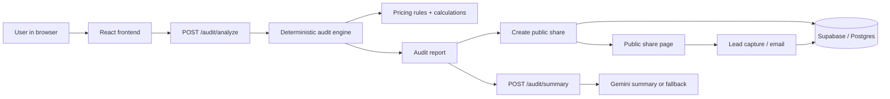

# Architecture

## System diagram

## Data flow

1. A user enters tools, spend, seat count, and team size in the frontend.
2. The frontend posts the payload to `/audit/analyze`.
3. The backend validates input, runs deterministic calculations, and evaluates the audit rules.
4. The engine produces a structured report with recommendations, savings, and risk levels.
5. The backend sanitizes the report, creates a share record, and returns both the report and public share link.
6. The frontend renders results from local state and optionally requests an AI summary for the report narrative.
7. Share pages and lead capture routes reuse the same stored report snapshot so the same audit can be circulated or followed up on later.

## Why this stack

The stack is intentionally boring. React + Vite gives a fast client UI, Express keeps the API easy to reason about, and Supabase/Postgres gives us durable storage without introducing a heavier backend platform.

The core business logic is deterministic on purpose. Financial recommendations need to be explainable and testable, so the audit engine lives in regular TypeScript instead of inside an opaque model prompt. Gemini only writes the summary layer, and even there the fallback path keeps the product usable.

## What I would change at 10k audits/day

1. Add a queue for summary generation and email delivery so the request path stays thin.
2. Move share rendering behind a CDN and cache the OG image responses aggressively.
3. Add rate limits and abuse detection keyed by IP, report hash, and share ID.
4. Split the audit engine into its own service if CPU usage or deploy size starts to matter.
5. Add observability around summary fallback rate, share traffic, and lead conversion so noisy traffic does not hide real usage.

## Trade-offs

- I chose deterministic rules over fully generated recommendations because the product has to survive scrutiny from founders and finance.
- I chose manual input over integrations because the MVP needs to work before any vendor sync exists.
- I chose a separate frontend and backend because the audit logic should be testable without React in the way.
- I chose public share pages because the share link is part of the product loop, not just a convenience feature.
- I chose a fallback summary because users should still get a result when AI is unavailable.
