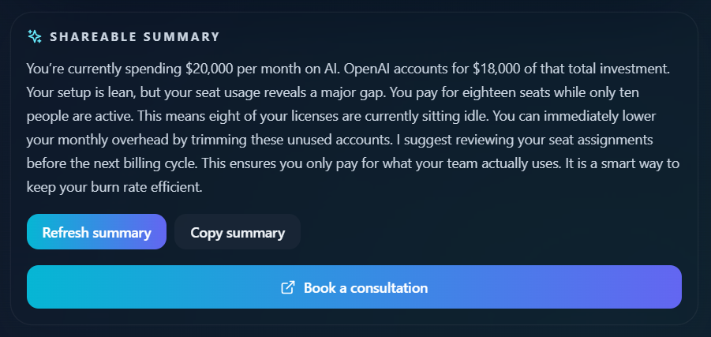

# AI Spend Audit

AI Spend Audit is a deterministic audit tool for teams that buy too many AI subscriptions too fast. It helps founders, engineering leads, and ops people identify seat waste, tool overlap, and plan mismatch without needing integrations or a finance team.

It is for early-stage teams with fragmented spending: company cards, reimbursements, personal plans, and tools that stay alive because nobody wants the cancellation argument.

## Recording

https://www.loom.com/share/a0cdea94423e418d83c6cdee0673ad01



## Quick start

### Install

```bash
cd backend
npm install

cd ../frontend
npm install
```

### Run locally

```bash
# backend
cd backend
npm run migrate
npm run dev

# frontend (new terminal)
cd frontend
npm run dev
```

Backend runs on `http://localhost:5000` and frontend on `http://localhost:5173`.

### Deploy

```bash
cd backend
npm run build
npm run start

cd ../frontend
npm run build
```

Deploy the backend to a Node host and the frontend `dist/` folder to static hosting. Set `VITE_API_URL` to the backend URL at build time.

## Decisions

1. Deterministic rules instead of model-generated math: recommendations need to be auditable and repeatable.
2. Manual input instead of integrations: it keeps onboarding fast and avoids an auth-heavy MVP.
3. Public share pages instead of private dashboards only: the share link is part of the product loop.
4. Separate backend and frontend instead of Next.js: it keeps the calculation engine isolated from the UI.
5. Optional AI summary with fallback text: narrative polish is useful, but the product cannot depend on it.

## Deployed URL
https://ai-spend-frontend.onrender.com
(Backend: https://ai-spend-backend-equy.onrender.com)
